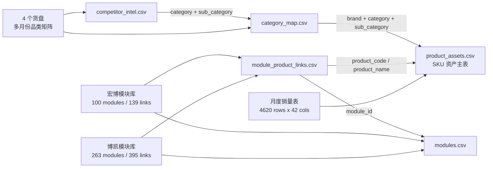

# RawData 重建为产品资产方案

> 范围：只分析 `RawData/` 下多文件多表，提出重建方案和可视化 demo。不执行数据重建，不覆盖 `data/`。

## 一、RawData 盘点

| 来源 | 文件 | 表结构 | 关键价值 |
|---|---|---:|---|
| 月度销量 | `RawData/Product Monthly Sales File/4月销量汇总表.xlsx` | 1 sheet，4620 条数据，42 列 | SKU 级销售、价格、成本、利润、退货、毛利率 |
| 工厂模块库 | `RawData/Module File Lib-(Organize files by factory)/博凯模块库.xlsx` | 7 个业务 sheet，263 个模块，395 条复用关系 | 正向模块资产和模块复用记录 |
| 工厂模块库 | `RawData/Module File Lib-(Organize files by factory)/宏博模块库(版型模块补充中)(1).xlsx` | 7 个业务 sheet，100 个模块，139 条复用关系 | 正向模块资产和模块复用记录 |
| 货盘 | 护腕/护膝/护踝/睡眠 4 个 xlsx | 多月份矩阵表 + TOP5 | 品类地图、竞品链接、团队升级思路 |

结论：重建产品资产时，**销量表做 SKU 主表，工厂模块库做模块和复用关系，货盘只保留品类地图、竞品情报和升级思路**。

## 二、目标数据模型

建议重建为 5 张表，而不是只压成一张“大宽表”：

| 目标表 | 粒度 | 来源 | 用途 |
|---|---|---|---|
| `product_assets.csv` | SKU/规格级 | 月度销量表 | 产品资产主表，支撑销量、未起量、毛利、价格带 |
| `modules.csv` | 模块级 | 博凯/宏博模块库 | 版型、面料、魔术贴、织带、支撑垫片、配件、外观 |
| `module_product_links.csv` | 模块 × 产品 | 模块库复用记录 | 回答“哪个模块用在哪些产品上” |
| `category_map.csv` | 品牌 × 品类 × 版型 × 月份 | 货盘月份表 | 支撑品类缺失、品牌迁移、爆品升级入口 |
| `competitor_intel.csv` | 竞品/升级线索级 | 货盘参考/备注/升级思路 | 支撑竞品升级和外部参考 |

## 三、关系图

## 四、字段方案

### `product_assets.csv`

保留销量表 42 列，并加标准化字段：

| 标准字段 | 来源字段 | 说明 |
|---|---|---|
| `sku_code` | 商家编码 | SKU 唯一标识 |
| `shop` | 店铺 | 渠道/店铺 |
| `brand` | 品牌 | TMT / SERUNA / 安踏等 |
| `category` | 分类 | 原始品类 |
| `product_code` | 货品编号 | 后续 JOIN 模块复用关系 |
| `product_name` | 货品名称 | 产品名称 |
| `spec_code` | 规格码 | 颜色尺码级 |
| `spec_name` | 规格名称 | 颜色尺码文本 |
| `sales_qty` | 实际销售量 | 未起量判断核心字段 |
| `profit_margin` | 毛利率% | 产品健康度 |
| `image_url` | 图片 | 图片引用 |

### `modules.csv`

| 标准字段 | 来源字段 | 说明 |
|---|---|---|
| `module_id` | 模块编号 | 模块唯一标识 |
| `module_type` | sheet 名/模块类型 | 版型/面料/魔术贴等 |
| `factory` | 生产工厂/文件名 | 博凯/宏博 |
| `module_name` | 模块名称 | 没有模块名称时用类型+编号兜底 |
| `size` | 模块尺寸 | 尺寸 |
| `material` | 使用材料/材料 | 材料 |
| `color` | 颜色 | 颜色 |
| `cost` | erp成本/价格 | 成本或报价 |
| `image_front_ref` | 正面截图 | WPS/DISPIMG 图片 ID，先保留 |
| `image_back_ref` | 背面截图 | WPS/DISPIMG 图片 ID，先保留 |
| `source_file` | 文件名 | 追溯来源 |

### `module_product_links.csv`

| 标准字段 | 来源字段 | 说明 |
|---|---|---|
| `module_id` | 模块编号 | 关联模块 |
| `reuse_idx` | 复用序号 | 同模块下第几条复用 |
| `product_name` | 产品名称 | 复用产品 |
| `product_code` | 产品编号/产品货号 | 关联产品资产，可能缺失 |
| `reuse_position` | 复用位置 | 主体/整体/魔术贴/内衬等 |
| `product_image_ref` | 产品截图/穿戴图 | 图片 ID |
| `source_file` | 文件名 | 追溯来源 |
| `source_sheet` | sheet 名 | 追溯来源 |

### `category_map.csv`

| 标准字段 | 来源字段 | 说明 |
|---|---|---|
| `month` | sheet 名 | 26年04月/2026.03 等 |
| `category_l1` | 一级品类 | 大类 |
| `category_l2` | 二级品类 | 二级类 |
| `sub_category` | 细分品类（按版型） | 版型语义 |
| `generation` | 代际 | 一代/二代等 |
| `brand` | TMT/SERUNA/JAFFICK/ANTA | 品牌列展开 |
| `product_code` | 货号行 | 品牌在该格子的产品 |
| `pallet_sales_note` | 销量行 | 货盘中的销量表达 |
| `upgrade_status` | 升级情况行 | 当前升级状态 |

### `competitor_intel.csv`

| 标准字段 | 来源字段 | 说明 |
|---|---|---|
| `month` | sheet 名 | 月份 |
| `category_l2` | 二级品类 | 品类 |
| `sub_category` | 细分品类（按版型） | 版型 |
| `competitor_url` | 参考 | 竞品链接 |
| `competitor_note` | 备注 | 竞品销量/特征描述 |
| `team_upgrade_idea` | 后续升级思路 | 团队判断 |
| `source_file` | 文件名 | 追溯来源 |

## 五、重建原则

1. **不让 AI 反推已有事实**：模块和复用关系优先用工厂模块库的结构化字段。
2. **不把货盘当产品主表**：货盘是策略层和竞品层，不是销售事实层。
3. **保留原始字段**：标准化字段之外，保留原始列用于追溯。
4. **图片先保留引用**：WPS 的 `DISPIMG` 公式先存 ID，不在第一阶段迁图。
5. **每张表必须有来源字段**：`source_file`、`source_sheet`、`source_row`。

## 六、Demo

可视化 demo 已放在：

`RawData重建方案_demo.html`

这份 demo 只做结构预览，不执行任何数据动作。
